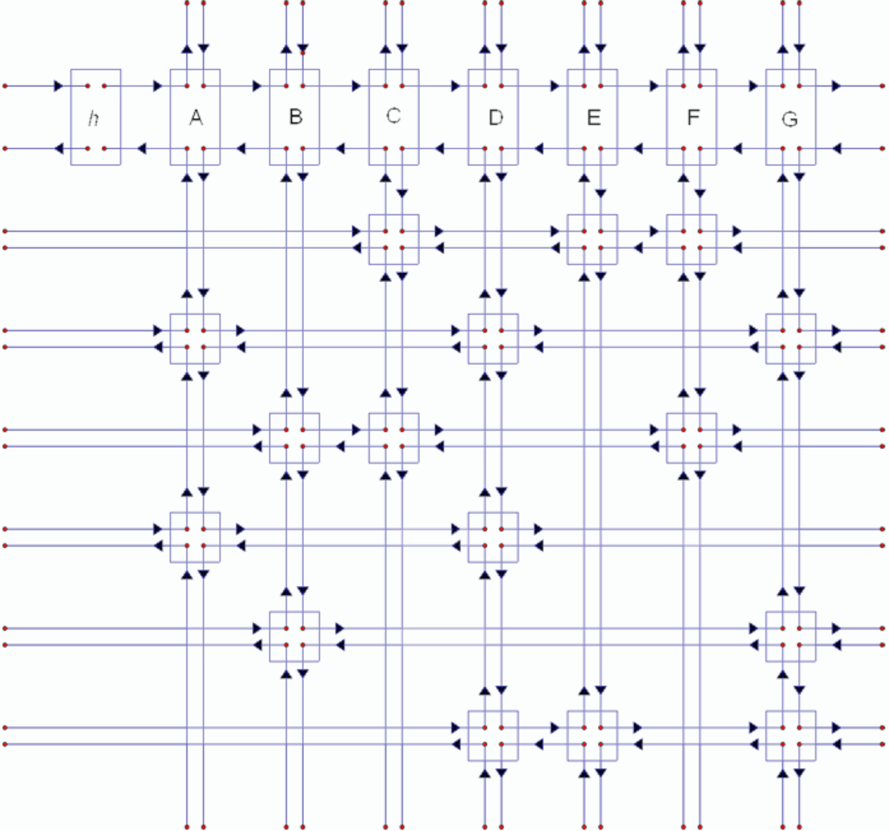

# sudoku

This project features a sudoku solver written in C. C was chosen since a good portion of this code takes advantage
of pointer logic. It uses Donald Knuth's Algorithm X and a dancing links data structure to solve this exact cover problem.
This program can be used to solve other exact cover problems, such as pentomino tiling or the n-queens problem.

* https://en.wikipedia.org/wiki/Knuth%27s_Algorithm_X
* https://en.wikipedia.org/wiki/Dancing_Links
* https://en.wikipedia.org/wiki/Exact_cover

## logic

Given a list of coordinates for an exact cover matrix, solution(s) are found by finding a set of disjoint rows with coordinates that
span all columns.

Example from wikipedia:

        1   2   3   4   5   6   7
    A   X   .   .   X   .   .   X
    B   X   .   .   X   .   .   .
    C   .   .   .   X   X   .   X
    D   .   .   X   .   X   X   .
    E   .   X   X   .   .   X   X
    F   .   X   .   .   .   .   X

If the above is the input matrix, a solution would be the set of rows { B, D, F }:

        1   2   3   4   5   6   7
    B   X   .   .   X   .   .   .
    D   .   .   X   .   X   X   .
    F   .   X   .   .   .   .   X

As you can see, each column has no more than, or less than, one X.

For sudokus, we can model them by seeing that for a board with:

    box dimensions = x & y,
    row, col, and box size = xy
    gridSize = xy*xy
    
we have 4 types of "constraints": values through xy must be in a row, column, and box, and no more than one value can be in a
single cell. These constraints are what define the matrix's columns (4*gridSize), and its rows represent the possible placement
of values, as well as the possible value (xy*gridSize).

Solving the matrix in this way allows us to easily find a solution for a sudoku puzzle.

## components

#### doubly and dance

The main data structure used here is the dancing link matrix ("dance"). It's a two dimensional linked "list"/matrix made up of
objects/structs ("doubly") that can point to other doubly. It stores its own coordinates ("drow", "dcol"), as well as an extra
pointer to its headers for ease of use. In the above example, each Doubly object would represent an X, and each Doubly would
point to the closest Doubly to their left, right, above, and below. Having pointers set up like this enables the program to
make common operations, such as traversing the matrix, fast that would be otherwise slow with something else like a 2D array.
For example, the two most common operations is covering and uncovering a doubly.

These operations:

    doubly->next->prev = doubly->prev
    doubly->prev->next = doubly->next

cover a doubly without having to delete it, and

    doubly->next->prev = doubly
    doubly->prev->next = doubly

uncovers it.

In Algorithm X, you usually cover and uncover rows and columns at a time, but you don't need to store the location of each
covered doubly. If you covered doubly1, then covered doubly2 (doubly1's immediate neighbor) doubly1 still has a pointer to
doubly2. And so now you can cover as many doubly as you want, and you only need memory for a single one.

note: uncovering doubly has to be done precisely in reverse order, otherwise the matrix would then be messed up

#### root, column & row headers

Frequently referenced as "hcol" and "hrow", the column and row headers are also doubly objects, as well as the matrix root.
The headers store useful information, such as how many elements are in its row, or how many in its column. They are also
used to easily access the matrix's elements. The root is simply the doubly above all row headers and to the left of all
column headers, and is the typical entrance point to the matrix.

To tack onto the list of advantages using pointers has, you can easily check whether or not the matrix is empty by just
calling:

    if(root == root->left)

Since covering the last element in a list will lead to this statement evaluating true, this simplifies a lot of things.
Due to how Algorithm X works, if there aren't any columns, there won't be any rows, and this check becomes simple.
(If a solution is found, the matrix will be empty like this)

Another thing to point out, since each column header doesn't have a meaningful row number, or a row header a meaningful
column number, instead I took advantage of the fact and used it to store the number of elements in its row/column.
But since now there's no way to tell if that doubly is actually a header or just a doubly with incorrect coordinates,
I added rmax and cmax appropriately to those values. This allows me both to easily tell if a column header is a column
header by calling

    if(doubly->drow > cmax)
        # doubly is an hcol

and to find the number of elements below it, that would just be

    num_elements_below = doubly->drow - cmax

This can also be done by using negative values to represent the number of elements below it:

    if(doubly->drow < 0)
        # doubly is an hcol
    
    num_elements_below = -1 * doubly->drow

This wasn't chosen simply in case unsigned ints were to be used in the future.

note: an "empty" matrix just means all the column headers have been covered
note: rmax and cmax are just the dimensions of the matrix
note: row headers aren't used for the computation itself, but are useful for printing and identifying solutions, and
initializing the matrix

#### solTrie

The solTrie objects are used to store the solution(s). Each row in the set of a solution will be pointed to by a solTrie
object. If a matrix has a single solution, the tree will just be a list, otherwise, it'll just be a normal tree with its
leaves signifying a solution. There's also no necessary order to the list/tree.
The tree grows along with the algorithm, since each call to Algorithm X is associated with a candidate matrix row.

note: solTrie isn't technically a trie

#### hide

The hide object is just a list of rows that you want to hide from the matrix. This is useful because all sudokus of the
same dimension have the same initial matrix, but given different clues, you eliminate different rows. Initializing
the matrix can be costly if you wanted to solve multiple sudokus, so this allows you to initialize it just once. This
functionality can also be helpful in generating sudokus.

#### heur & heurList

In Algorithm X, you have a list of columns to choose from. One heuristic is choosing a column with the least amount of
elements underneath. heurList is a list of list of heur objects. Each heur is tied to a column header, along with the number
of elements currently underneath it. When a doubly under a column header is covered or uncovered, the column header's element
count is appropriately incremented or decremented, the heur it's linked to is moved from one heur list to another, and a
heur headers are created and destroyed when a new column is needed or when a heur column no longer has elements.

        1   2   3   4   5   6   7
    A   X   .   .   X   .   .   X
    B   X   .   .   X   .   .   .
    C   .   .   .   X   X   .   X
    D   .   .   X   .   X   X   .
    E   .   X   X   .   .   X   X
    F   .   X   .   .   .   .   X
    
heurList:

    root - h(2) - h(3) - h(4)
            |      |      |
           col1   col4   col7
            |
           col2
            |
           col3
            |
           col5
            |
           col6

This enables you to get a column header with minimal elements underneath in O(1) time.

    min_hcol = root->hnext->next

The incrementing and decrementing operations are also in O(1) time.
Choosing a column with minimal elements, while a heuristic, doesn't guarantee a faster solve though.
For some cases, The program can be faster if it chose a random column or the first uncovered column,
so its commented out at the moment.

## process

The program takes in a file of a sudoku you want it to solve, and takes note of its dimensions, x and y.
It then creates a file that lists the coordinates of elements in the initial matrix. hideAllCells() then covers
the appropriate rows of the matrix according to the given clues in the sudoku. coverRowHeaders() covers all the
row headers for the algorithm to run properly. Algorithm X is run on the matrix, creating a solTrie in the process.
uncoverRowHeaders() uncovers all the row headers, and unhideAllCells() uncovers the previously covered rows. Another
sudoku board with the same dimensions can also be run now without having to reinitialize the matrix.

If you wanted to use this for another exact cover problem, the code has been made modular so you can just swap out and
create your own function that writes to a matrix coordinate file. The overall process is the same.

## matrixFile creation

While difficult to implement pointers in python effectively, it can be used for writing to the matrixFile

## todo

#### short term goals

improve user interface\
add boards for higher dimensions, ex. 2x2x2, 2x3x4, 3x3x3x3\
figure out an efficient way to generate boards

#### long term goals

design an app/web app for this program

## data

longest recorded time to create a random fully populated board of varying sizes:\
(rows are chosen nondeterministically)\
3x3: 0.05 sec\
4x4: 0.14 sec\
4x5: 0.26 sec\
5x5: 0.6 sec\
5x6: 18 sec\
6x6: 5 mins\
7x7: unknown / too long

time to create a canonical fully populated board of varying sizes:\
(rows are chosen deterministically)\
3x3: 0.035 sec\
3x17: 12 sec\
3x18: 5 sec\
3x19: 55 sec\
4x4: 0.13 sec\
4x12: 2 min 30 sec\
5x5: 0.48 sec\
5x10: 2 sec\
5x11: 4 sec\
5x12: 6 sec\
5x13: 1 min 21 sec\
6x6: 0.9 sec\
6x7: 1.2 sec\
6x8: 1.4 sec\
6x9: 3 sec\
6x10: 4 min 45 sec\
7x7: 2.5 sec\
7x8: 12 sec\
7x9: 25 sec\
8x8: unknown / too long