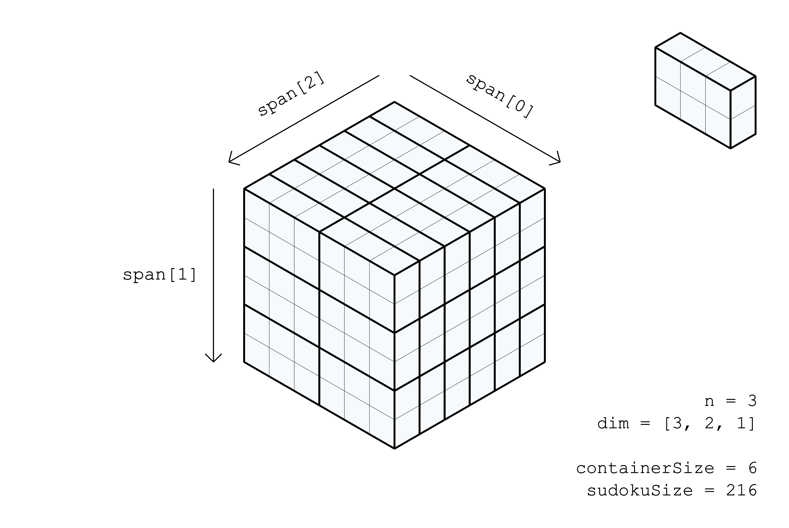
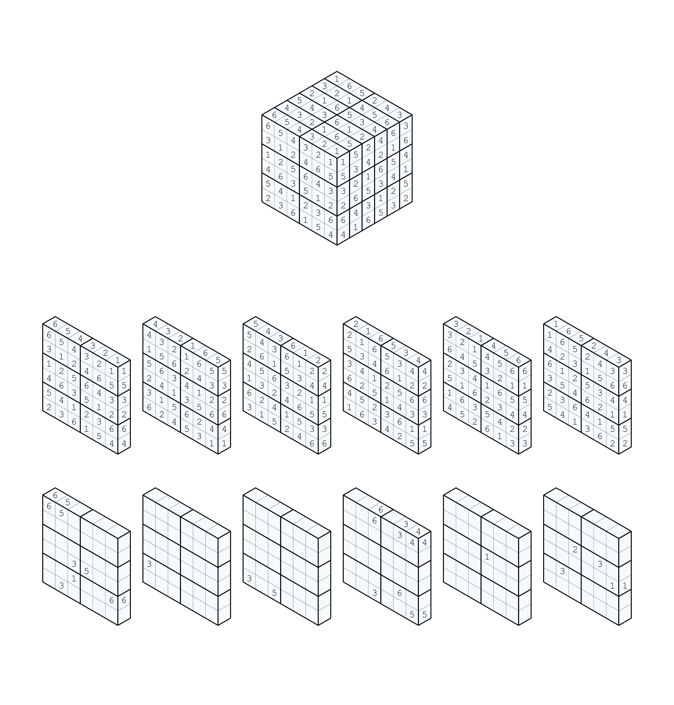
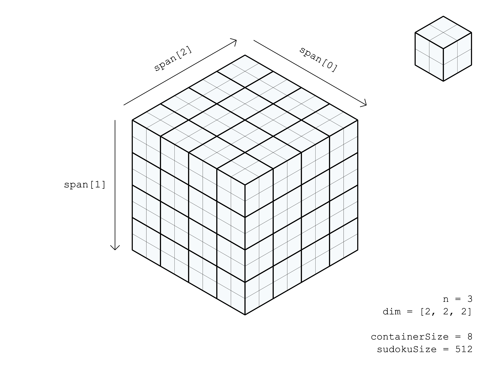
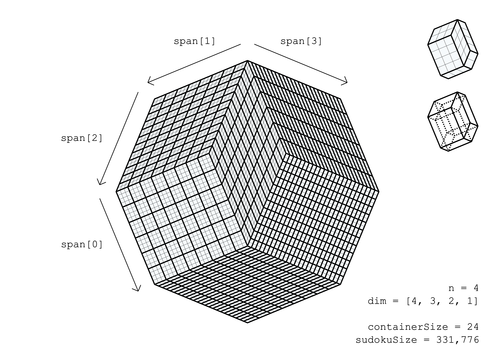

# multidimensional generalization

A traditional sudoku is typically called a "9x9" sudoku, but could also be denoted as a [3, 3] sudoku. The [] notation describes the dimensions of a single "box" in the sudoku, and the entire sudoku's dimensions can be constrained by this alone. The length of the sudoku along each dimensions is the product of all of its box dimensions. In the "9x9" case, the length and width of one box is 3 and 3 respectively, and the length and width of the entire sudoku is 3x3 = 9. Since the box dimensions constrain the sudoku's dimensions, the process of defining the sudoku's dimensions can be said to start from the given box dimensions. The first box's shape is duplicated and stacked against each other in each dimension until the desired sudoku shape is reached.

# terminology
To make this easier to communicate, I have come up with some terminology that is specific to this project. In a traditional sudoku, you have rows, columns, and boxes. In a generalized multidimensional sudoku, the rows and columns are called "span" and boxes are called "containers". So for a traditional "9x9" sudoku, there are 2 types of span for the 2 dimensions (row, col) each 9 cells long, and the containers are also 9 cells in size.

# n
This is the number of dimension of the sudoku. From the [] notation, this is the length of the list.

# containerSize

This is the size of the containers, and the length of all span, units being number of cells. This number is calculated as the product of all container dimensions. In a traditional [3, 3] sudoku, the containerSize would be 3x3 = 9. Another example: a [4, 3, 2, 1] sudoku has a containerSize of 4x3x2x1 = 24.

# sudokuSize

This is the size of the entire multidimensional sudoku, units being number of cells. This is calculated as: containerSize ^ n. Note: It should be clear that a sudoku with dimensions [3, 3] is different from a sudoku with dimensions [3, 3, 1], as the first will have 9^2 = 81 cells while the second will have 9^3 = 729 cells.

# span and containers

There are n number of span types (row, col, etc.) each of containerSize length. In the diagrams below, the span types are differentiated using "span[i]", i being the dimension index number. There are (sudokuSize / containerSize) number of containers (81 / 9 = 9). This numContainers is also the number of span of a span type. Each set of span of a span type, and the set of all containers partition the sudoku.

# matrix

For the dancing links data structure, there is a 2D matrix.

Matrix rows describe the possible placements of individual number symbols in the sudoku, as well as the possible values it can have, so the total number of rows is calculated as: sudokuSize * containerSize.

Matrix columns are the constraints following the rules of sudoku. The number of columns for each constraint in parentheses.
* No more than one number can be in a cell. (sudokuSize)
* No more than one of each value in each container (sudokuSize)
* No more than one of each value in each span (sudokuSize * n)

# bSat

Another method besides dancing links is boolean sat. Although not fully implemented yet, it should yield faster results in generating these sudoku, as they can get very large quickly. The speed of solving these sudoku with bSat compared to dancing links is unknown, and dancing links has been fast enough so far.

# diagrams

A 3x2x1 sudoku layout:

A sample 3x2x1 puzzle and its solution:

(This specific puzzle can be found in sudokuFile_example.txt)

A 2x2x2 sudoku layout:

For higher dimensions, an orthographic rhombic representation can be useful to visualize all possible 2D surfaces of a sudoku as an n-cube.

A 4x3x2x1 sudoku layout:

